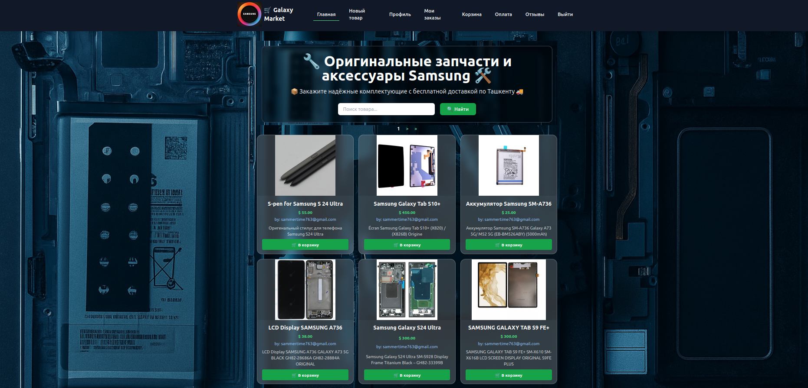
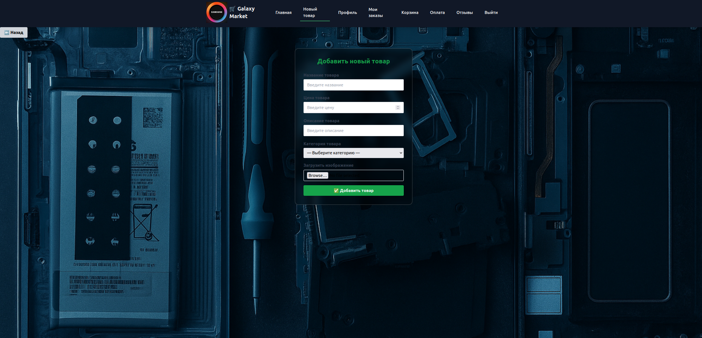
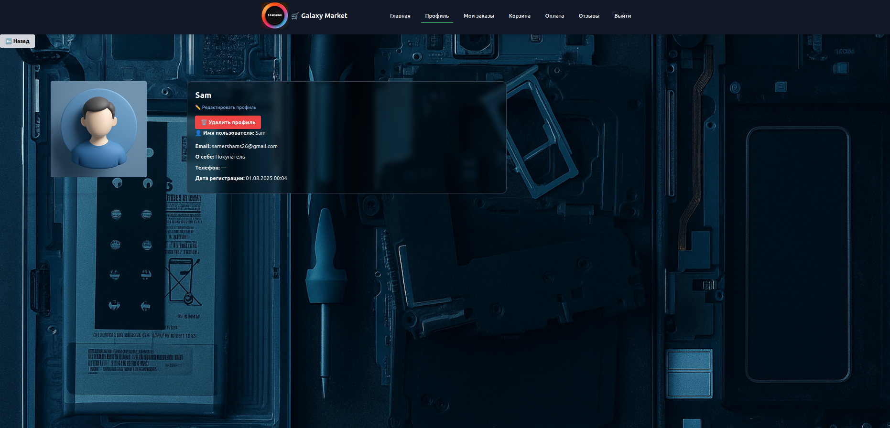
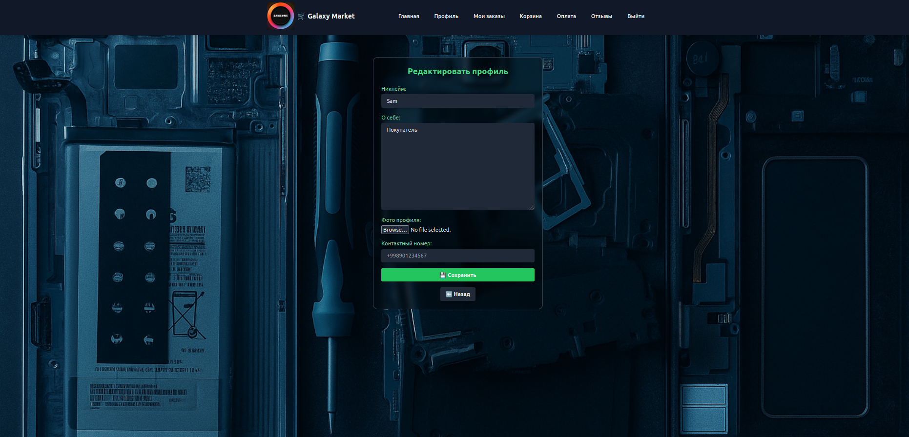
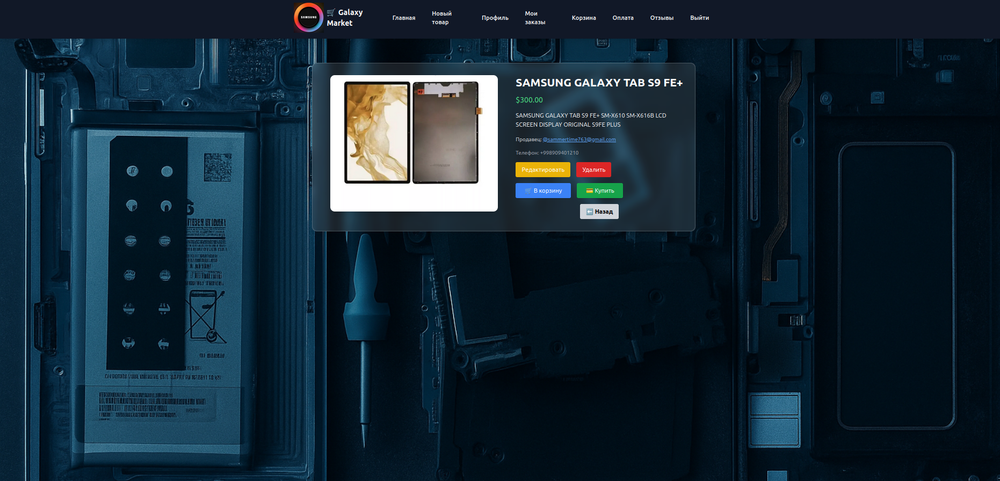
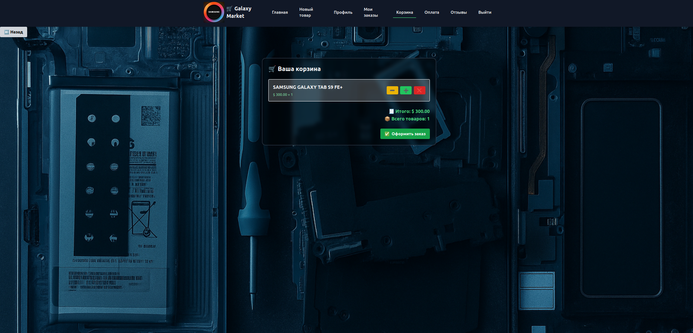
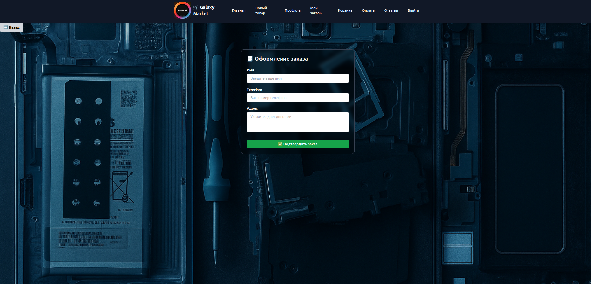
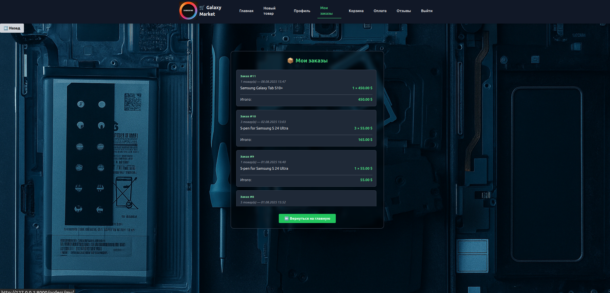
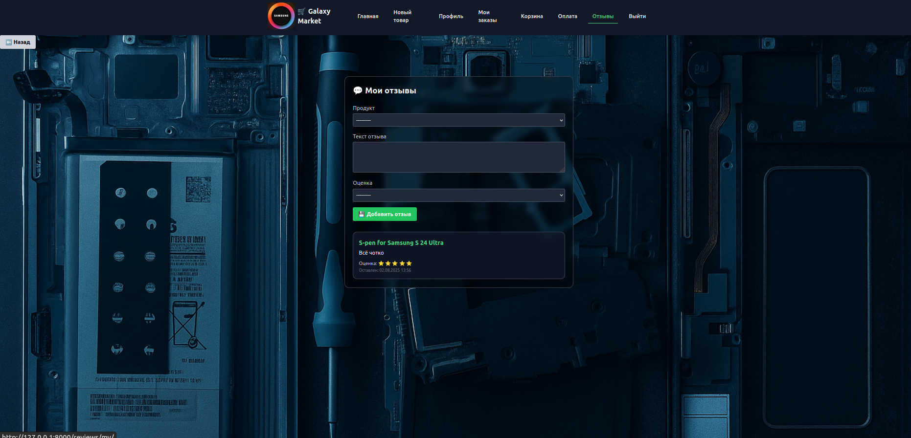

# 🚀 Galaxy Market

**Galaxy Market is an educational e-commerce project designed to demonstrate skills in working with Django, databases, Docker, and responsive layout. It implements a full-featured online store system with order placement, user registration, and an admin panel.**

**An online store of original spare parts and accessories for Samsung devices.
The platform is built with Django, features a responsive design, a convenient shopping cart, and an order management system.**

## ![Galaxy Market Screenshot]
## 📷 Screenshots

### 🛍️ Product Catalog


### ➕ Add Product


### 👤️ Profile


### 📝️ Edit Profile


### 📦 Checkout


### 🛒 Cart


### ✅ Order Confirmation



### 📦 My Orders


### 💬 User Reviews



## ⚙️ Technologies

🐍 Python 3.10 — main programming language

🌐 Django 4.0.10 — web framework (MTV architecture)

🐘 PostgreSQL 15 — database management system

🐳 Docker + Docker Compose — project containerization

🧠 Redis 7 — state storage and caching (via Docker)

🎨 Tailwind CSS — utility-first CSS framework

🔧 PostCSS + Autoprefixer — for Tailwind build process

💳 Stripe — online payment integration

🖼️ Pillow — image processing (avatars, catalog)

🔗 django-widget-tweaks — form field customization in templates

🌍 django-cors-headers — handling CORS requests (if frontend is separate)

🔐 python-dotenv — loading environment variables from .env

🧰 psycopg2-binary — PostgreSQL driver


## 🔥 Main Features

👤 User registration / authentication

🛍️ Product catalog with categories

🧺 Adding products to cart

💳 Order placement (name, phone, address)

🔄 Order history and tracking

📦 User and seller profiles

✨ Reviews, payments and confirmations

🧾 Fully responsive UI

🖼️ Avatar upload and profile editing


## 🛠️ Admin Panel Capabilities

* User management

* Product and category management

* Order processing

* Review moderation


## 🐳 Installation & Run with Docker

```bash
# 1. Clone repository
git clone https://github.com/your_username/galaxy-market.git
cd galaxy-market

# 2. Build and run containers
docker-compose up --build

# 3. Open in browser
http://localhost:8000

# 4. 🛠️ Initial setup (after launch)

    📌 Apply migrations:

# 5. docker-compose exec web python manage.py migrate

    🔐 Create superuser for admin panel:

# 6. docker-compose exec web python manage.py createsuperuser

# 7. 🔑 Admin panel available at:
http://localhost:8000/admin/


```

---

## 🔗 Links

- [Project website] — to be added

- [GitHub repository:](https://https://github.com/Mr-Shams86/galaxy_market)


## 📢 **Contact**

👤 **Author**

- ๛Samer Shams๖

- **Email**: sammertime763@gmail.com

- **Telegram**: [Mr_Shams_1986](https://t.me/Mr_Shams_1986)

---

---

## 🏢 **Galaxy Market — Project Structure**

```
📦 Project
├── ⚙️ config/ — Django base configuration
│   ├── admin.py — admin settings
│   ├── asgi.py — ASGI configuration
│   ├── __init__.py
│   ├── settings.py — main project settings
│   ├── urls.py — top-level routes
│   └── wsgi.py — WSGI configuration
│
├── 🐳 Docker & run files
│   ├── docker-compose.yml — Docker services configuration
│   ├── Dockerfile — build instructions
│   ├── entrypoint.sh — container startup script
│   └── manage.py — Django entry point
│
├── 🖼 media/ — user-uploaded files
│   ├── images/catalog/ — product images by category
│   │   ├── accessories, batteries, headphones, phones, etc.
│   └── profile_images/ — user avatars
│
├── 🛒 orders/ — order management
│   ├── admin.py — model registration in admin panel
│   ├── forms.py — order forms
│   ├── migrations/ — database migrations
│   ├── models.py — Order and OrderItem models
│   ├── urls.py — routes
│   └── views.py — business logic
│
├── 🛍 products/ — product catalog
│   ├── admin.py
│   ├── apps.py
│   ├── mixins.py — helper/mixin classes
│   ├── models/
│   │   └── product.py — product model
│   ├── migrations/
│   ├── tests.py — catalog tests
│   ├── urls.py
│   └── views.py
│
├── 💬 reviews/ — reviews management
│   ├── forms.py — review form
│   ├── models.py — Review model
│   ├── templatetags/
│   │   └── extras.py — custom template filters
│   ├── migrations/
│   ├── urls.py
│   └── views.py
│
├── 👤 users/ — authentication and profiles
│   ├── admin.py
│   ├── apps.py
│   ├── forms.py
│   ├── models/
│   │   ├── user.py — custom user model
│   │   └── profile.py — user profile model
│   ├── migrations/
│   ├── signals.py — automatic profile creation on registration
│   ├── templatetags/
│   │   └── form_filters.py — custom template filters
│   ├── tests.py
│   ├── urls.py
│   └── views.py
│
├── 📄 templates/ — HTML templates
│   ├── base.html — base template
│   ├── navbar.html — top navigation bar
│   ├── orders/ — cart, checkout, my orders
│   ├── products/ — catalog, details, add, delete
│   ├── reviews/ — my reviews
│   └── users/ — login, registration, profile, delete
│
├── 🌐 static/ — project static files (CSS/images)
│   ├── img/ — interface images
│   │   ├── background, default, logo
│   └── products/
│   ├── styles.css — custom styles
│   └── tailwind.css — Tailwind styles
│
├── 📦 requirements.txt — Python dependencies
├── 📦 package.json / package-lock.json — Node dependencies (Tailwind)
├── 🌀 tailwind.config.js / postcss.config.js — Tailwind configuration
├── 📄 README.md — project description
├── 📄 structure.txt — saved project structure
└── 📄 url_adress_in_my_Gadjet_Shop.txt — useful links/addresses


```
